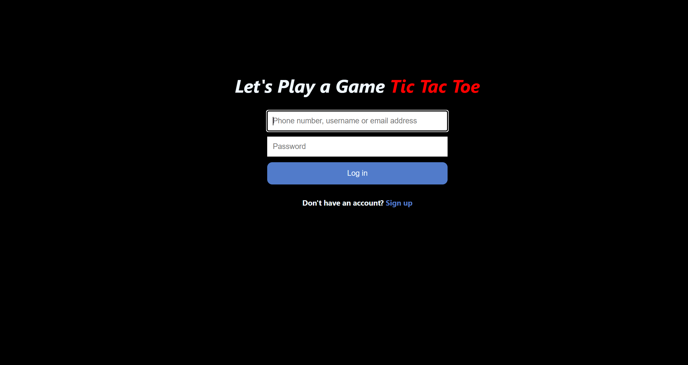
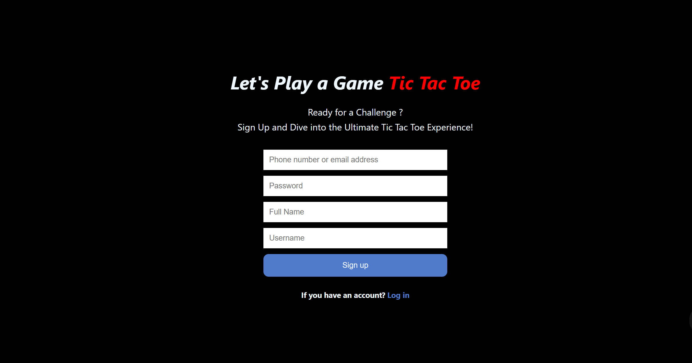
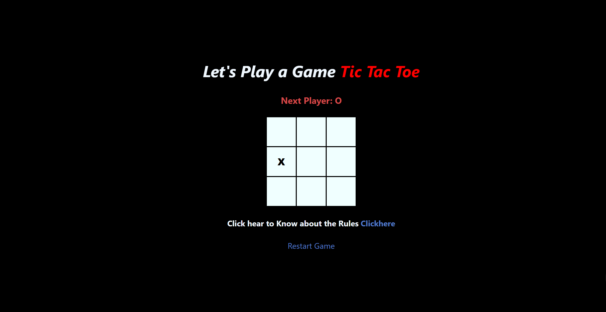
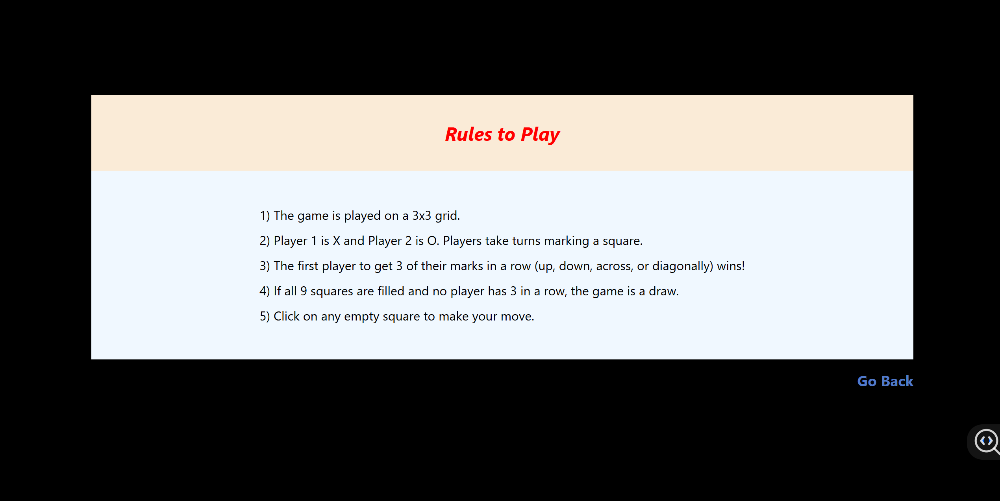

# 🎮 Tic Tac Toe Game with Authentication

A modern and interactive **Tic Tac Toe** web application built using **React**. This app offers a smooth user experience with **login/signup authentication**, personalized game access, and intuitive gameplay. The interface includes styled components, a rules page, and the ability to restart the game.

---

## 🌟 Features

- 🔐 **User Authentication**
  - Login and Sign-up forms with input validation (no backend).
  - Navigation handled with `react-router-dom`.

- 🎲 **Game Logic**
  - Classic 3x3 grid game for two players (X and O).
  - Real-time status display and winner/draw detection.
  - Restart game feature via page reload.

- 📘 **Game Rules Page**
  - Separate route `/Rules` to display how the game works.

- 💅 **Styled UI**
  - Custom CSS for user forms, game board, and transitions.
  - Responsive and user-friendly layout.

---

---

## 📽️ Demo

🎬 [Click here to view the demo video](https://github.com/golusubhavani/TicTacToe/blob/main/WhatsApp%20Video%202025-04-11%20at%2018.07.04_d28cdf05.mp4)

---

## 📸 Screenshots

## Login Page

## Signup Page

## Game Page

## Rules Page

## 🚀 How to Run

1. Clone the repository  
   `git clone https://github.com/golusubhavani/TicTacToe.git`

2. Navigate into the project folder  
   `cd TicTacToe`

3. Install dependencies  
   `npm install`

4. Start the development server  
   `npm start`

5. Open your browser and visit  
   [http://localhost:3000](http://localhost:3000)

   ## 👩‍💻 Author

**Bhavani Golusu**  
📧 [bhavanigolusu03@gmail.com](mailto:bhavanigolusu03@gmail.com)  
🔗 [LinkedIn](https://www.linkedin.com/in/golusu-bhavani-/)  
🔗 [GitHub](https://github.com/golusubhavani)

